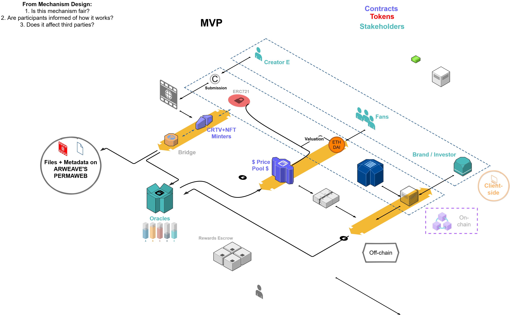

# Creative Platform Documentation

[Description](./#description)

[Assumptions](./#assumptions)

[The business model](./#the-business-model)

[Features/Requirements](./#features-requirements)

[Stages](./#stages)

* [1. Execution 🔨](./#1-execution)
* [2. Review 📏](./#2-review)
* [3. Iteration 🔧](./#3-iteration)

[Outline and time estimation](./#outline-and-time-estimation)

* [1. UX Design](./#1-ux-design)
* [2. UI Design](./#2-ui-design)
* [3. Coding](./#3-coding)

[Further information](./#further-information)

## Description

In order to come up with a product that is able to attract early adopters, we need to be able to demonstrate that the concept is achievable is terms of technology. For that reason, we will be building a **proof of concept** \(POC\) or better called **prototype**.

This proof of concept should be able to showcase the core features of the Creative platform and has the main objective of verifying that the idea has the potential in a real-world situation. Basically it aims to determine whether the project is feasible and will function as planned.

The POC that encloses this MVP starts with a **design**. In this design the team makes ideation of the **product vision, hypothesis and KPI's** to measure to come up with a lean solution.

## Assumptions

This building process is based on the [Creative Whitepaper](untitled.md) which describes the general vision. In our vision, we want to build a working product that assumes the following:

* **Who will be the users?** 

Creators of any kind of content \(mostly audiovisual\) on one side. Institutions \(Brands\) willing to support creators in exchange for custom and fresh NFT assets that hold acruing valuation overtime or value added propositions for them.

* **What value does your product offer?** 

A financial instrument to finance a community that creates partnerships and businesses around the NFTs and DeFi.

* **What problems does your product solve?** 

The absence of a platform for creatives to earn a living and progress in value based on their reputation of success.

* **When and how much revenue will it generate?** 

As long as the platform goes into production. It is expected to bring 980 millions CRTV tokens to the market for use of uitliity throughout the platform with an initial valuation of USD 0.1 per token.

* **What determines your product’s success and failure?** 

Community acquisition and engagement based on the capital locked into the platform  and usage metrics.

* **When will you deliver it?** 

Depends on the timelines set on each project.

* **What is the core functionality of your product?** 

To create a liquidity pool in which ‘sponsors' can put capital and distribute the funds to a selected proposal submitted by a ‘creator’ that matches with the ‘sponsors’ requirements.

At the time of writing, the previous might have been already iterated. For that reason, this document is considered a continuous work in progress and it should be updated regularly in conjunction with the teams learnings, insights and decisions.

## The business model

Before we dive into the details of what our MVP does let’s talk about why are we doing it. To address this we make use of the Blockchain Model Canvas. It is a diagram that shows that our business idea is attractive enough for future investors and most importantly the end users.

_**Note: it is highly important that you understand the following diagram because while we can assert general procedures on how we will be doing everything and we set deliverables to reach our goals you will be working on your own most of the time. If you design and code without a purpose and a real understanding of why things are done in a certain way, you will not only feel bound but you will not learn. As a team we want everyone to profit from this project not only in terms of professional growth**_ _**but also intellectually**_ _**.**_

The diagram you are about to see will be discussed and iterated accordingly every meeting so if you have doubts around the approach we take towards it don’t hesitate to let us know. Think of it as the road necessary to start the execution of each MVP phase. Here you can see our draft of the **Blockchain Model Canvas**:

[See actual flowchart here.](https://viewer.diagrams.net/?highlight=0000ff&edit=_blank&layers=1&nav=1&title=Untitled%20Diagram.drawio#Uhttps%3A%2F%2Fraw.githubusercontent.com%2Fg2entgroup%2Fcreate-future%2Fmain%2FUntitled%2520Diagram.drawio%3Ftoken%3DAALL2BJKO33O2IIBUZVOPO3AO5KEE)

## Features/Requirements

The idea of the MVP is to showcase the most important functionalities of the product to understand its underlying value leaving aside any additional usability that might be misleading or time consuming in terms of development. The following table illustrates how many functionalities might be filtered depending on its correlation to the core business of the project and their relevance in order to get the product up and running.

The idea behind the requirements is to set aside what the product **must** do, from what it **should** do and what it could do. The table below shows rough examples of how the product process goes into defining the previous:

| **must** | **should** | **could** |
| :--- | :--- | :--- |
| Project docs setup and lifecycle management | Push notifications | Bonus System |
| Storage model | Localization | Animation |
| REST api | Reviews | SMS-notification |
| Login & Registration process | Social integration | Tips |
| User profile & Edit user profile | Traditional Payment integrations \(Stripe\) | Wish list |
| Campaigns Search filters | Chat & Notifications | User Stats |
| Capital injection-withdrawal transactions |  |  |
| Submit campaigns |  |  |

This proof of concept should have the following features/requirements. _**Please comment in here what you consider our MVP should have**_:

1. It should be able to login users with a crypto wallet integration.
2. It needs to put a ‘campaign’ on chain with a locked value.
3. It needs to generate an interest based on the amount yielded in the liquidity pool.
4. It needs to receive NFT’s that works as a proposal to match with the campaign submitted.
5. It needs to deliver the funds yielded to a selected winner and split all the interest among the players in the transaction.

‌

The way this project is executed is by using [Scaffold-eth](https://github.com/austintgriffith/scaffold-eth) to leverage each and every feature the Ethereum ecosystem brings to the table. The first thing the team needs to achieve is a way to manage NFT's \(non-fungible tokens\) properly. The team decided to use [Arkane](https://arkane.network/)**.**

‌

We are using Mumbai network \(0.1 ERC20\) which is set up on top of Goerli network. It already has a balance from the faucet of 0.05ERC20 \(the infura link is created using Goerli's network\). Two connections received both from Mumbai. The .env file is the local environment. We need to make sure our mainnet is Mumbai and localnet is on Rinkeby.

## Stages

The pre-ideation stage started on Feb 16/2021, it started with a draft document that has been edited by the team.

Note: After ideation has been shared with the entire team and each and _**every member understands the core business**_ _**as well**_ as the _**set of functions**_ each individual is _**in charge**_ of _**the project is**_ considered _**kicked-off**_. The [_**discord general chat**_](https://discord.gg/qm3aXqSe) should work as a way for the team members to ask for questions regarding any of the matters of the project overall. For inquiries regarding individual tasks, members should reach out to the scrum master or owner of the project to get further information.

The founding team have drafted a way to bring the product up to reality by determining a clear set of steps to follow. These steps are supposed to be done continuously until the MVP proves to find an audience with a demonstrated intent to use the platform.

### 1. Execution 🔨

This stage focuses on building. There is no time for thinking on the feasibility to add more things or come up with ideas to improve. This part of the process consist of working on the current **sprint** available on Jira’s workspace \(Creative Token\) and depending on the commitment of each and every member it can either get to the next point or get stuck. The way to know when the execution part is over is by having reviewed and accept all the **\[backlogs\]** that make part of the **\[sprint\]** to initiate the review stage. E.g. Dapp has a working landing page that logs the user in and executes a simple transaction with Arkane Network, UI updates the balance promptly, blockchain uses account that deploys the contract, etc.

### 2. Review 📏

Review consists on analysis. This part of the process evaluates the performance of the current state of the product. It should have tangible metrics intrinsic either to the code/design or the performance of the software overall. It puts all the pros and cons of the existent features and define what stays and what goes in order to improve the product. The way to know this stage is done is by having an accurate report that indicates the specific way to start the iteration part. E.g We are able to audit each and every transaction on the blockchain, the current smart contract spends x amount in gas, transaction is totally automated from start to end, etc.

### 3. Iteration 🔧

As an ongoing process, what proved to be wrong gets changed. This part defines a new way of executing certain processes according to adjusted parameters and paves the path for a new phase of execution. Iteration can be considered done when there is a new defined set of tasks to repeat or better to take to execution. E.g. Enforce ownership for this type of user, replace the interest rate from a time base ratio to a quadratic funding model to apply democratic incentives, refactor the inputs to start using an oracle to fetch data from.

## Outline and time estimation

The following are the building blocks to have a working product. Each and every component of this outline passes the previous 3 stages until it is considered achieved or developed.

#### 1. UX Design

Key deliverables of this stage are user personas and user journeys helping future customers fulfil their tasks quickly and easily, and drive conversions \(for products\).

#### 2. UI Design

At this stage, custom design of user-facing parts \(buttons, menus, tabs\) is created. We have designated [Chakra](https://chakra-ui.com/) and [Next.js](https://nextjs.org/) as the UI framework to work with based on the fact that they are optimized for React, it has a great acceptance from the community and last but not least it is well supported for real-time active development.

Note: ****the stage is reasonable only if design is a competitive advantage, otherwise it’s better to use default themes and focus on the MVP functionality.

#### 3. Coding

* **Back-end development** to build the MVP server side and APIs.
* **Front-end development** to transform static interface images provided by UI designers into a fully functional MVP client side, and ensure its communication with the server.
* **Testing** runs in parallel with development.

The result of this phase is a **working MVP well hosted** and with very accurate **supporting documentation.**

## Further information

Thank you for reading carefully and contribute to this awesome project . Remember, **we are building the future of entertainment** .

You have reached the end of this documentation! 

