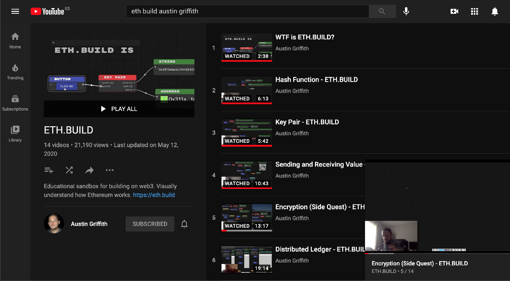

# Credentials, integrations, procedures and Blockchain Flowcharts

The ARKANE API generation was successful, and we already have a key for using their services on Ethereum Staging. The client-id is: **Creative-Platform.**

‌[**ARKANE WALLET:**](https://docs.arkane.network/widget/) ****

For our **staging environment**, please use the following endpoints:

**Identity:** [https://login-staging.arkane.network](https://login-staging.arkane.network/)

**Connect:** [https://connect-staging.arkane.network](https://connect-staging.arkane.network/)

**Wallet interface:** [https://staging.arkane.network/](https://staging.arkane.network/)

On Ethereum staging, we use the Rinkeby Ethereum network.

[**INFURA**](http://infura.io/) **ID** \(on Rinkeby Test network\): xxxxxxxxxxxxxxxx

[**FORMATIC**](https://fortmatic.com/) **API KEY:**

Testnet: pk\_test\_xxxxxxxxxxxxxxxx

Production \(localhost\): pk\_live\_xxxxxxxxxxxxxxxx

[**PORTIS**](https://www.portis.io/) **API KEY**: xxxxxxxx-xxxx-xxxx-xxxx-xxxxxxxxxxxx

[**ALCHEMY**](https://www.alchemyapi.io/) **API KEY**: xxxxx\_xxxxxxxxxxxxxxxx

[**ETHERSCAN**](https://etherscan.io/) **KEY**: xxxxxxxxxxxxxxxxxxxx

‌

Address designed for development: PENDING.

Chakra & Next.js for UI \([discord channel](https://chakra-ui.com/discord)\)

Polygon \(for off-chain network\)

Chainlink Verification: 

The Graph \(api’s integrations\)

Aave \(lending platform\)

Diamond Standard \(EIP-2535\): NFTs

Community.xyz \(DAO\)

[Superfluid](https://www.superfluid.finance/) \(for streamed-value\)

## Procedures for MVP

Here you find the way to make your work code as is to start developing

Building the PoolTogether tripod \([Pool-Contracts](https://github.com/g2entgroup/creative-contracts)+[BuilderUI](https://github.com/g2entgroup/pooltogether-pool-builder-ui-going-to-creativeUI-)+[ReferenceUI](https://github.com/g2entgroup/pooltogether-reference-pool-ui-going-to-creativeUI-)\): Please follow the **README copy.md** of every repository taking into account that depending on the environment you are trying to launch there will the conditions to be met. For that reason, there are files such as Constants.js storing credentials or hardhat.config.js/hardhat.network.js/next/config.js/etc that retrieve specific data to have a customized deployment.

## Blockchain Flowcharts

This space is used to post all the information regarding trials you can run. The trials you might need on a regular basis might be transactions mostly but most importantly the behavior of the network overall and with the changes applied through our smart contracts.

The process is the following:

1. In order to use the flowcharts you will need test ETH. Get them from the available faucets: [Rinkeby](https://faucet.rinkeby.io/), [Göerli](https://goerli-faucet.slock.it/), [Ropsten](https://faucet.ropsten.be/), [Kovan](https://kovan.faucet.enjin.io/).
2. The platform you will use to visualize such trials is [eth-build](https://eth.build/). This works as a playground where you can prototype constructors, code structures you are building, etc. It is highly recommended checking the [tutorials available](https://www.youtube.com/playlist?list=PLJz1HruEnenCXH7KW7wBCEBnBLOVkiqIi) on the topic to understand how to use it:

Examples already build:

1. [Transaction between Accounts on Rinkeby](https://sandbox.eth.build/wofCrGxhc3Rfbm9kZV9pZMONAX3EgcSDxIVsaW5rxIvEjQLCoMKlxIfEiXPDnAAVworCosSMxI4ywqR0eXBlwqpJbnB1dC9UZXh0wqNwb3PCksOMwoJ4wqRzaXplwpLEjiwywqVmxIJnc8KAwqVvcsSJcgDCpG3EiGUAwqbElcSwdHPCkcKDwqRuYW1lwqDEqMSqxZjCpMSUxJbDgMKnb8SxxZzFnsWgxaLFpMWmxKnEq8KmxIRyxJVnwqXFq2vFnsONAkbCqnByb8SrcnRpZXPChMKrYmxvY2vGjFPFgmUywqtwxIJjZWhvbMWSwq9lbnRlciDGp8S2IGjGqGXCpcaLdGxlwqTEtMS2wqV2YWx1ZcKobXlzZWNyZXTCicSkxI0BOcWnxKvCqkRpc8acYXkvUVLEuMS6xYUEalrFgMaYxYUBwpDEjsKQxYnFi8WNxY_FkcaoDcWVxZfFmcWbxLHFnsKExaHFo8Wlx43FqcW_xoJKxb5hYmVsw5kqMHhkYTVmOWViNjNiNDUxM2ExNmE2ZThmNGFkYjEwNzjInTk4YjAyNMipxoXGh8aJxovGjcKCwqZxcsaXxYPEjhjFvmlnaHTDgsSjxKUBOse3wq3HkMeSxILHlVdhdGNox5nEu8aCRMOix5_Fg8WFAzE8x6ZhxYzFjsWQxZIKx63EicevxK_HscKRx7PFtMe2xbfHuMSVa8aCS8e8x75swqDFrsWwyaPJpce1xbbFqADIuMSWc8OAya7Hv8KgyKvGiMaoyK5zwoHGsWnGs8awyYjJimjIvseKTMmCyYTHk8mHyYnJi8mNxYUIKsaCwpfJksWEw4zDiMmXxYrJmceoyZzGqAHJn8WYxZrJosWdyaTHtMW1x7fFlMW_yb3EgsmvybHFr3TFscqtyabJt8SrybnFv8m8yb7JsMqByK3GjMqFyofKicKlyovJi8qOxI42x7fCrlXGi2xzL0bGh20gV2VpypfDjQQGw40DFsqdwoLCoTDDjMKgwqExGsmYxYzCgcKpY8ahxIJwx4Jkw4LHqcWSE8qoyaHKucWzx7XCpcewdMmCbnVtx75yLMW6xbzFqsmqxoJ4ybLKuMmjy77FpMKmyrfFnMe3wqbMhMyGxqjJusaAwpHGgmTLg8qDy4XCgcKoxIljaW3Gu3MSy4wBPce3wqzErsWcL0LEsXRvbsudAljGgsOayp3EvMOIxYjKosmay7jGqALLu8qqy73KrsmnxajDv8yMxazMkMWxwpLMk82NxKvDv8ydxoECUc2Vyrxlwq7MmsyHLGJvxqFlYW7NmcOAzKLGisuFwoPGuca7xr3CqGPElMaUIMWky4fGtMKmzLZ0zLjNqcuxdcamJMyuxrXJqMStyqvEs8S1xLfEucmOAcO-y6F6zYDFhs2Dx6fJm8eqcgPNicyBxbLNjM2eyrHJqsWtzJbMks6dzJjMim7Fvcq_zJ8CwoHNrMqExo_GkcaTxpVlyLTGmcabxp3Gn8ahxqPGpcanxqnGq3TGrcavzbnGtca3dM2wxrxlyIHIgzdCNcikZWYxZjgzMzgyNTVENzkxOTkyz6BBM0MxyJnPkzNBQkQ5z4zMrkDMscuRacuTxLNvy5nLm8y7wp7LocOoy6TLpsOMwqrLqsuszYTKpM6XCc6ayqvOnMmmzIDKq8yYzaHGqM2QyasCwpfNks6jyabMlcmzzILJqMyZzIXMh82ZzqrCg86tzKTMpseDzKnMq8ytx4nEjmrJgk9iaseDxLLQq9CtY86Lx5rDjQUoxoLDkM6SAhzDjMK0y63Qg8WSD9CGxbHCl82dzJhv0KzQrtCPxoLCic2Vz4bGvce3wrTOpmcs0I3MiNGI0LHMgsqyzZXCpMiFdGHRkdGT0ZXQm8aoLNGY0YrRm82MwqNnxIPRoXTFu86n0aPMm9GX0YnQstCPw4DNlcKo0axzUMW7xp7RrtGw0ZTRltGm0bXRms6g0Y7Eh27Rv8mo0ZLRr8W80bLNotGn0bbRqcmmwqLMuNKA0o_Sg9KS0obNkc6ixZ3Rhc6k0JnSm82q0Y7Gus-H0IzRpH).
2. [NFT Unique hash creator](https://sandbox.eth.build/wofCrGxhc3Rfbm9kZV9pZMONATDEgcSDxIVsaW5rxIvEjQJFwqXEh8SJc8KYworCosSMxI4rwqR0eXBlwq1EaXNwxIJ5L1dhdGNowqNwb3PCksONAsOaxI42wqRzaXplxLwDMTzCpWbEgmdzwoDCpW9yxIlyBMKkbcSIZQDCpsSVcHV0c8KRwoTCpG5hbWXCoMSmxKjFmsKkxJTElsS9PsKlxIJiZWzCoMKnb8WfxZ7FoMWixaTFpsWoxarEqQDFssSVa3PDgMWyYcW0xbbCqnByb8SpcnRpZXPCgcKlxpN0bGXCpcSzxLVoxKHEowEsxoHEqlN0csSVZy9MZW5ndMS3xLnEu8S9w6TEjsK4xYLFhMWGw4zCjBrFi8WNxY_FkcWTZXIFxZfFmcWbxZ3Fn8WhwoPFvsWnwqbEhMapxq_GpceQxqjGqsWtxoXEvUDFuMW6x4vFvcWlx4_Gm8avxrHHlG51bcW0csaExJbGh8aJxotCxo3Gj8aRxpPGlcKAxqHEjQEtxqXEq8StxK9hxLFDb2zFksS4xLrFhyDDjMK0xrnFhcKSxrwyxr9hxY7FkMWSxZQHx4fEiceJbsW7xaHFo8egxoDEp8aCx5jFrwJBx67FtcW3xbl0yJvHn8W_xanIoMWax6vGhsaIxbPIp8exxpDHhMe0c8KCxphpxprGnMiByIPHqnZhbHVlwqY4MThhZmHHt8SOKMalwqtDcsSodG8vSMSDxrLIhsS9HMSOIsiLxYZ4HsiQyJLHgsWUA8iXxZrFnMiax57HjciewqXHinTHu8eRxqosx6bHqMeEyKJrxL1Fx5zIqsmvx45lwqRoyZvHlMm2xq_IsXPCk8Wwx5rEvcewxo7It8aSxpTFj8mPAS7GpcKwxqfHksarU3ViypzGqsiFxrQCRGTJosKCwqEww4zCvsKhMULJpseByJTHhAbJq8iZyJvCk8mwxb_HlcqdxqUAybzKkMq7xafCpcSEYcaSx6XHp8epy4ECQ8uDyYfHosawaMuJybpyy4xEyoDIq8uPwqbIqcW7yojHlsqKxa7GhsKRxL1ByLbHs8qVyLvLhsaSAsKmy5HGsQbKlzDGpcKsScmudC9Oy4rHhMqkxLwBNsOMxanFg8iMyq3Ij8WMyJHKs8eDcsuAxZjImMmty5rKg8iuxavLgMuiw4DLmcqCyJ7MksSpwqbJucepyovLpMqmy6fIuMqVwoPCq8e-Y2VoyILFlMKhI8i8yL7Cpsu6y5XCpcmDyYVlwqE2ypcvy7TLtsW7y7nLu3LLvcSOVDLJosiNwr7MhseAyJPMigHKt8yPzJjIrcq_ybzMlsudzZDFp8yayYfMnceEzJ_EvUPMosqUxpXMpcynzKnMq8eEzK3Mr8abzLHNgMy0yYTJhsKhMsqXKcalwrHGp8WSyJFlL0ZpxpsgRMeyy73DjMKWxI5KzYbDjMOCJMqyzYvFlALKt8yXxbzLm82VybTIr8q9xqrNnMSazahlwqlORlQgSU5QVVTNn8i5woHCpGbNu2XCont9yovCl86CAj7JkADEpAAAzrBAzrPEjizFm8qJZ86wQcSOLs60x7nOts6wQs66ypjPhs2dxI4vz4QuAcyczYDOsETEjjDPj8utzZpyzrBFxI4pz4QoAMKtzr7JuM2AwqZnxo91cHPCkMKmY29uzqhnwoDCp3bHhMWDz7DDiz_DmcKZz73PvcKa)

